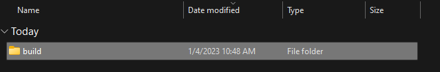

# Development

## Project set up
Then follow these instructions to start developement:

1. Open the project in your favorite IDE

2. Open [chrome://extensions](chrome://extensions) in the browser and go to step 4. If your not able to open the link. Click on the jigsaw icon in the top right corner of the browser.

   

3. Click `Manage Extensions` at the bottom of the pop-up

   

4. Enable `Developer mode` in the top right corner.

   

5. Click `Load unpacked` in the top left corner.

   

6. Select the `build` folder from the unzipped folder that was downloaded and click `select folder`.

   

7. The plugin should now be installed!

   


## Development
There are a few development tool that you can use.

### Github
We use GitHub to manage our code. In this project GitHub Action are used for Continuous Integration and Continuous Deployment. The actions acn be found in this project under the .github folder.
Please note that the publish.yml action needs keys to be able to run. These keys are stored in the GitHub secrets. Go to Project Settings -> Secrets to add the keys -> Actions. And you will see the following keys being used.
When opening them they seem to be empty this is for security reasons, so you can not copy them, but they are in used.

When Pushing to the master branch the code will be automatically test the code with the unit tests and checks for code coverage.

When merging master in to the publishing branch the code will be automatically build and published to the Chrome Web Store.


### Watch
While development, you must run the watch command to watch for changes in the code and automatically compile the code.
``` terminal
npm run watch
```
When you have run the watch command, you can start developing. but you will need to refresh the extension in the browser to see the changes.


### Format
If you want to format the code you can run:
``` terminal
npm run format
```

## Testing
?> This is done automatically with GitHub Actions when you push the code to GitHub and you are able to see the results by downloading the zip, extract the zip and open index.html in the browser.
### Unit tests
When there has been changes made to the code you may want to run a test to see if everything is working as intended.
``` terminal
npm run test
```

### Unit tests with code coverage
This will run the unit tests and generate a code coverage report. It wil tell yoy how much the code is covered by the unit tests.
``` terminal
npm run test-with-coverage
```

## Build
!> Make sure the versioning is changes after each build to keep track
### Versions to change before build:
1. package.json
2. public/manifest.json
3. docs/_coverpage.md

When the versions have been changed you can run the build command to build the plugin.
``` terminal
npm run build
```
When running this, it will create/replace a build folder with the compiled code.

This makes the code as small as possible so that the extension is as lightweight as possible.

## Build and Zip
!> Make sure the versioning is changes after each build to keep track
``` terminal
npm run zip
```

This with do what the build command does but also zip the build folder and create a zip file in the root folder named release.

You kan then use the zip file to upload to the Chrome web store.

## Generate code for Chrome Web Store Github Action
When you want to publish to the Chrome web store, you need to generate a code for the Chrome Web Store.
``` terminal
npm run generate-code
```
the code that are generated will need to be added to the GitHub secrets. Go to Project Settings -> Secrets to add the keys -> Actions. And you will see the following keys being used.
When opening them they seem to be empty this is for security reasons, so you can not copy them, but they are in used.


## Publish to Chrome Web Store
When you want to publish to the chrome webstore, you just need to merge the master brand on to the publish branch.

Steps:
1. Go to the publish branch
2. Merge the master branch on to the publish branch.
3. Push the publish branch to GitHub
4. This will trigger a GitHub Action that will publish the extension to the Chrome Web Store.

This will zip the build and publish it to the Chrome web store. This can take time for approval on the web store.


## Documentation
When editing the documentation, you can run the doc on a local server to see live changes in the browser.
``` terminal
npm run serve-docs-locally
```
[Docsify](https://docsify.js.org/#/) is used to create the documentation.

## Further Development

### manifest.json
The manifest.json file is used to tell the browser what the extension is and what permissions it has. This is also used for specifying the files.

### background.js
The background script is used to run the code in the background. This is used where all the logic is. 
The scriptInjection and the menu use the background script to get the data. Look as if the background script the brain of the plugin.

### scriptInjection.js
The scriptInjection is the script that is injected in the LinkedIn page. this script wil pee part of the website able to display html and run javascript.

### utilities.js
The utilities script is used for running function that does not do anything with the th Chrome API.

### contentScript.js
The contentScript script is used for the login when the manifest detects that the user is on a login page of Mploy Associates en will activate the contentScript.

### profile.js
The profile script is used for handling data the has to do with the profile that is wanted to be saved.

### popup.js and popup.html
The popup script and html is used for the popup that is shown when the user clicks the plugin icon, this script will communicate with the background script for data and settings.

### menu.js and menu.html
The menu script and html is used for the menu that is shown when the user clicks the plugin icon and click to go to the dashboard or right-clicks the plugin icon en selects options, this script will communicate with the background script for data and settings.

### style.css
The styles is used for the menu and popup. There is one file to keep the elements the same.


