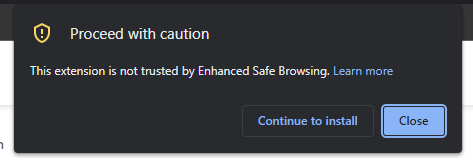
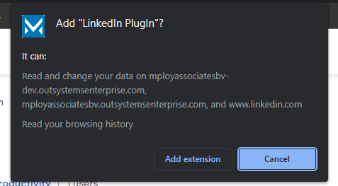
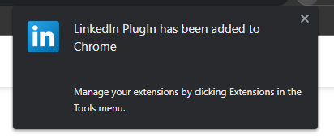

# Installation

[//]: # (## Installing from the Chrome Web Store)

!> Make sure you to open the link in Google Chrome. This is a Chrome plug-in and only works in Google Chrome.

1. Go to the [Chrome Web Store](https://chrome.google.com/webstore/detail/linkedin-plugin/hcepbnomhgponnlgannhehcmiokmcioi)

2. click `Add to Chrome`.

3. If you get this, click `Continue to installed`:

   

4. click 'Add extension' in the popup.

    

5. The plugin should now be installed!

    

[//]: # (## Manual Installation)

[//]: # (1. Please request release from IT or Download the latest zip version of the plugin from the [releases page]&#40;https://github.com/lucasmoes/linkedinplugin/releases&#41;.)

[//]: # (2. Unzip the file that was downloaded and save the folder to a safe place on the computer.)

[//]: # (3. Open [Extensions]&#40;chrome://extensions&#41; and go to step 5. If your not able to open the link. Click on the jigsaw icon in the top right corner of the screen.)

[//]: # (![img.png]&#40;img/img.png&#41;)

[//]: # (4. Click `Manage Extensions` at the bottom of the pop-up)

[//]: # (![img_2.png]&#40;img/img_2.png&#41;)

[//]: # (5. Enable `Developer mode` in the top right corner.)

[//]: # (![img.png]&#40;img/img_4.png&#41;)

[//]: # (6. Click `Load unpacked` in the top left corner.)

[//]: # (![img_3.png]&#40;img/img_3.png&#41;)

[//]: # (7. Select the `build` folder from the unzipped folder that was downloaded and click `select folder`.)

[//]: # (![img.png]&#40;img/file_location_in_zip.png&#41;)

[//]: # (8. The plugin should now be installed!)

[//]: # (![img.png]&#40;img/img_6.png&#41;)

How do you use the plugin? Check out [Usage](/usage.md)
