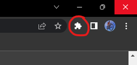

# Tips and Tricks

## Plug in Icon
The plug in icon changes color to indicate the status of the plug in, the colors are as follows:
- Blue: The plug in knows that you are on a LinkedIn profile.
- Gray: The plug in does not detect that you are on a LinkedIn profile.

## Easy menu Reach
It helps to get the best functionality from the plugin by pinning it to the browser toolbar.
* You can see the icon change to see if the plug in detects a LinkedIn profile.
* You can click the icon to open the menu.

1. Click the jigsaw icon in the top right corner of the browser.

   

2. On the LinkedIn icon click the pin icon. 

   

This will pin it to the toolbar of the browser for quick access.
