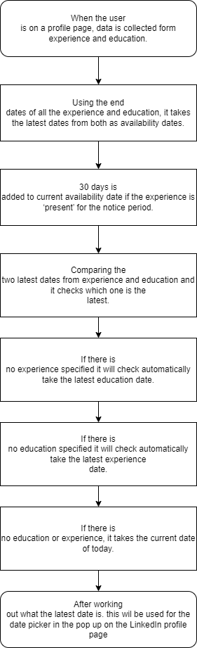

# FAQ
## Why does the plug in log out after a while?
The plug-in works with your microsoft account, for security reasons the user receives a security code that the plug in uses to securely send data to the database, this code has an expiration date, so the user must log in again to refresh the code.

## How do you use the plug in?
Check out [Usage](/usage.md)

## How do you install the plug in?
Check out [Installation](/installation.md)

## How do you update the plug in?
Check out [Updating](/updating.md)

## Why does the icon change color?
The icon changes color to indicate the status of the plug in, the colors are as follows:
- Blue: The plug in knows that you are on a LinkedIn profile.
- Gray: The plug in does not detect that you are on a LinkedIn profile.

## Why is the save button red?
When the button is red, there is certain data missing that is required when saving profile and stops the user from saving the profile.

## Why does the save button shack and turn red?
When the button shacks and turns red, the plug in is trying to save the profile but is not able to do so. Please ask IT for assistance.

## Why are there profiles with the same name?
Firstname and last name is not unique, so there can be multiple profiles with the same name. The url is unique and is actually a different person.

## Why can I not select a certain recruitment type?
The recruitment type selection is disabled becasue the profile is already saved in the database.

## How is the availability of the candidate determined?

