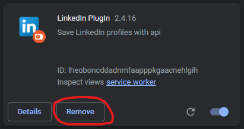

# Updating

It could happen that the plugin needs an update. To update the plugin follow these steps:

!> The plugin is fully reset when you remove it. This means that you wil have to log in again and make sure the settings are correct. Profiles saved wil not be lost as they are stored in the database.

## Downloaded from the Chrome Web Store
You wil not need to update the plugin manually if you have downloaded it from the Chrome Web Store. The Chrome Web Store will automatically update the plugin when there is a new version available.

## Manually Installed
1. Remove the old plugin from your browser.

    

2. Follow the steps the [Installation](/installation.md) guide.

3. The plugin should now be updated!

