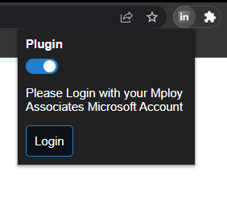
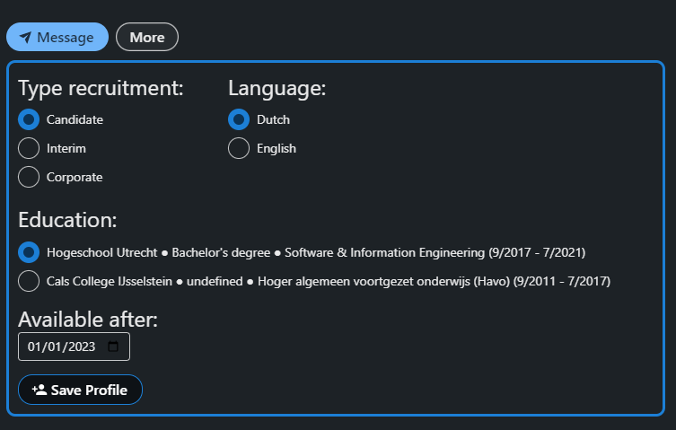
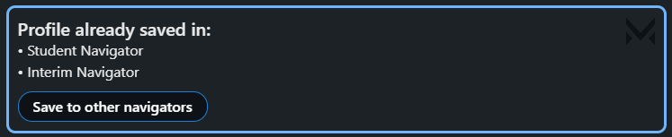
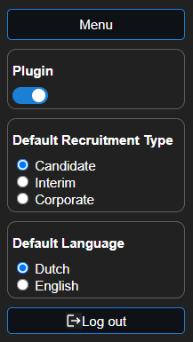
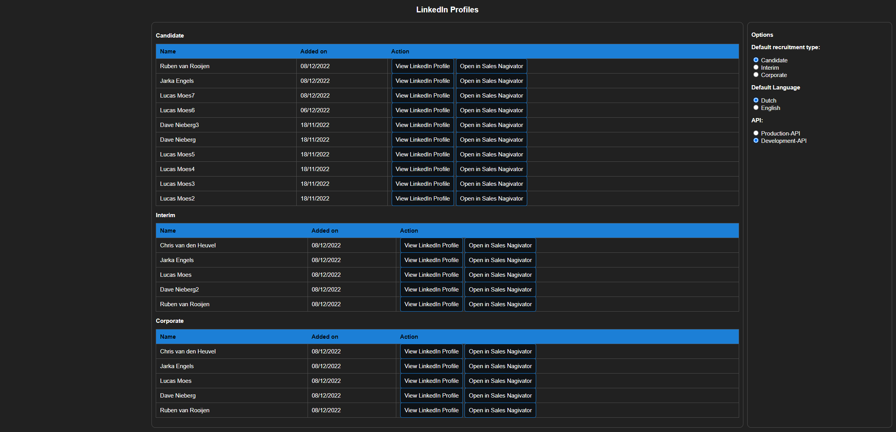

# Usages
?> Make sure that you have followed the instructions for the [Installation](/installation.md) of the plug-in before following the usage documentation!

## Login
1. To use the plug in open a LinkedIn Profile or by clicking the 
   jigsaw icon and click the plugin icon in the list.
   Click on the plugin icon opens the plugin login in popup.

   

   

   

   or when your on a LinkedIn profile page

   

2. Clicking the login button will bring you to a login page of Mploy Associates.
3. Login with your microsoft account from Mploy Associates.

## Saving a profile

1. After Logging in, when you are on a LinkedIn profile the plug in will automatically detect the profile and will insert a box on the LinkedIn Profile page.
2. Select the desired recruitment type.
3. Select the desired Language of the candidate(Added because some users have there profile in English but can speak Dutch).
4. Select the education that best fits for the role.
5. The Available date picker is done automatically, this shows when the candidate is available to start working, if certain that the candidate is available on a different date the user may change it.
6. Then you can click on the save button to save the data to the database.

## Already saved profiles

This will be displayed when you have saved the profile already, you can click on `Save to other navigators` to save the profile to another navigator.

You will see that depending on where you already have saved the profile, these options will be disabled to prevent duplication.

The `Save to other navigators` button will not be shown if the profile is already saved to all recruitment types.

## Pop up Login

* The `Plugin` switch is on, the plug in will show the box on the profile page and when the switch is off will stop showing the box on the profile page.
* The `Login` button will open the login page.

## Pop up Menu

* The `Menu` button is used to open the menu of the plug in.
* The `Plugin` switch is on, the plug in will show the box on the profile page and when the switch is off will stop showing the box on the profile page.
* The `Default Recruitment Type` is used to set the default recruitment type for the plug in. When selecting it wil refresh the LinkedIn profile pages with the new default recruitment type.
* The `Default Language` is used to set the default language for the plug in. When selecting it wil refresh the LinkedIn profile pages with the new default language.
* The `Log out` button is used to log out from the plug in.

## Plug In Menu

### Middle
- In the middle is a list of users that you have saved the profile split up in to 3 different categories.
  1. Candidate 
  2. Interim 
  3. Corporate

- Buttons on each profile
  1. `View LinkedIn Profile` button is used to view the original LinkedIn Profile.
  2. `View Profile` button is used to see the data that is stored in the database.

### Right
- On the right side of the menu the options to change the recruitment type and language and for development purposes choose which api to use.
  1.  Set the `Default recruitment type` (Will refresh the LinkedIn profile pages with the new default recruitment type).
  2.  Set the `Default Language` (Will refresh the LinkedIn profile pages with the new default language).
  3.  Set the `API` for production or development (Only developers can activate this option).

